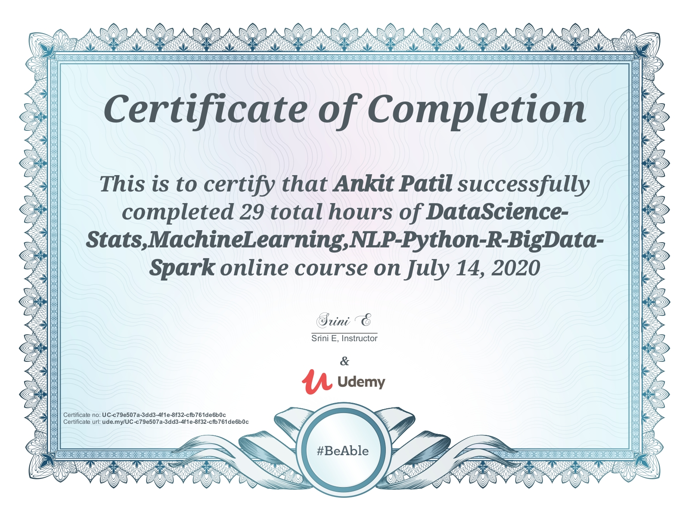
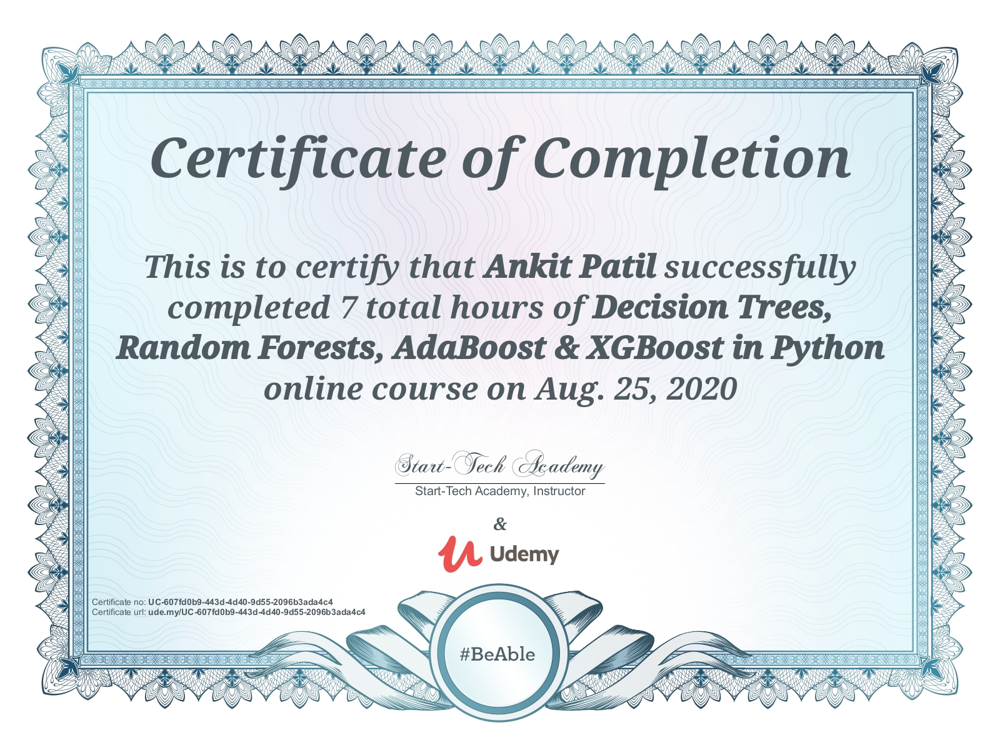

# Certifications

## Data Science - Stats, Mahcine Learning, NLP-Python,R,BigData - Spark

* This course covers basics to advanced concepts of Stats, Machine Learning, Natural Language Processing and BigData through technologies like Python, R and Spark.

  

## Decision Trees, Random Forest, AdaBoost & XGBoost in Python

* This course covers everything about Decision trees. The course also covers data cleaning and data pre-processing activities required for Data Science.

  

