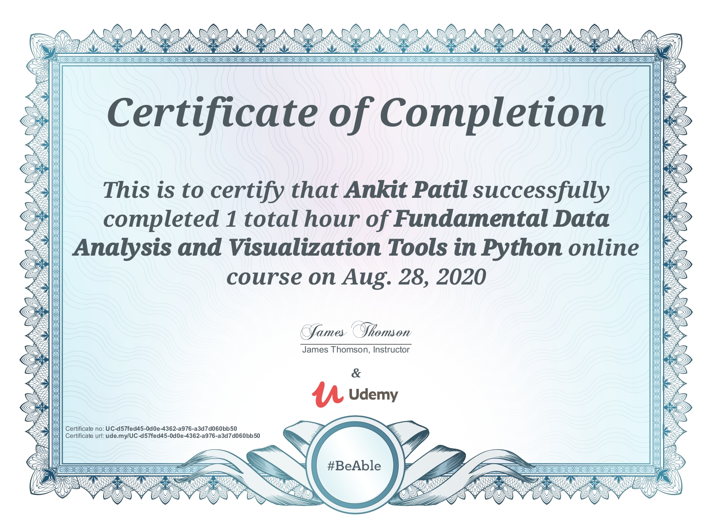

# Certifications

## Data Science - Stats, Mahcine Learning, NLP-Python,R,BigData - Spark

* This course covers basics to advanced concepts of Stats, Machine Learning, Natural Language Processing and BigData through technologies like Python, R and Spark.

  

## Decision Trees, Random Forest, AdaBoost & XGBoost in Python

* This course covers everything about Decision trees. The course also covers data cleaning and data pre-processing activities required for Data Science.

  

## SQL Masterclass - SQL for Data Analytics

* This course covers all the concepts that are required for Data Analytics. 

  

## Fundamental Data Analysis and Visualization Tools in Python

* This course covers the visualizations libraries that are used to create different visualizations in Python. The course also contains user inerractive visualizations in Python. 

  

## Data Analytics Fundamentals

* The course covers basics of Data Analytics in AWS environment.

  

## The Python Mega Course: Build 10 Real World Applications

* The course covers basics to advanced level of Python programming. Through 10 real world applications we gain hands on experience on Python.  

  

